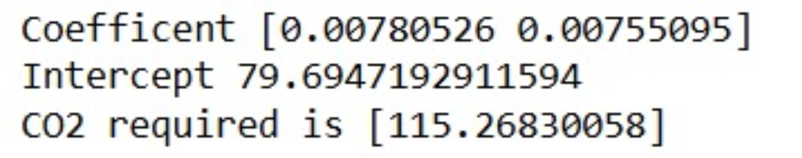

# Implementation of Multivariate Linear Regression
## Aim
To write a python program to implement multivariate linear regression and predict the output.
## Equipment’s required:
1.	Hardware – PCs
2.	Anaconda – Python 3.7 Installation / Moodle-Code Runner
## Algorithm:
### Step1
<br>
Load the dataset.
### Step2
<br>
Select Volume and Weight as features and CO2 as the target.

### Step3
<br>
Train a linear regression model.

### Step4
<br>
Retrieve coefficients and intercept.


### Step5
<br>
Predict CO2 for the given input [3300, 1300].

## Program:
```
#Developed by: PAUL SHERVIN.P
#REG.NO:24901141

import pandas as pd
    from sklearn import linear_model
    df=pd.read_csv("car (1).csv")
    x=df[['Volume','Weight']]
    y=df['CO2']
    regression=linear_model.LinearRegression()
    regression.fit(x,y)
    print("Coefficent",regression.coef_)
    print("Intercept",regression.intercept_)
    print("CO2 required is",regression.predict([[33001300]]))


```
## Output:


### Insert your output

<br>

## Result
Thus the multivariate linear regression is implemented and predicted the output using python program.